# SPK-AHP

Aplikasi Pemilihan Dosen Terbaik Menggunakan Metode AHP Berbasis Web

## Screenshots

<pre>
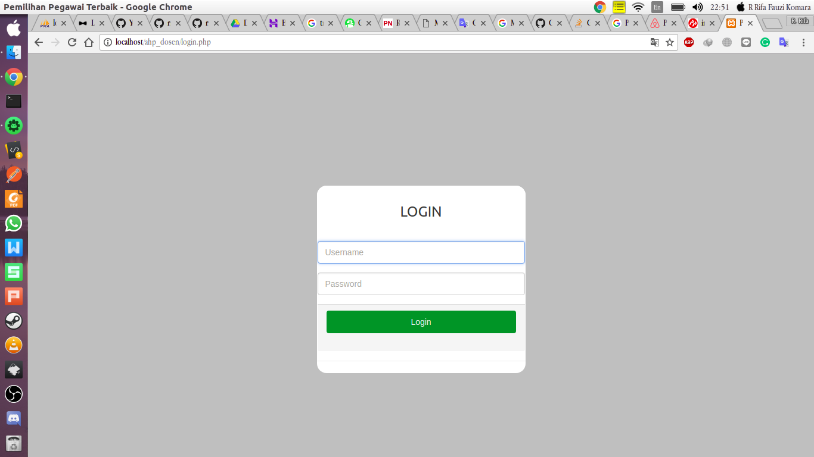                  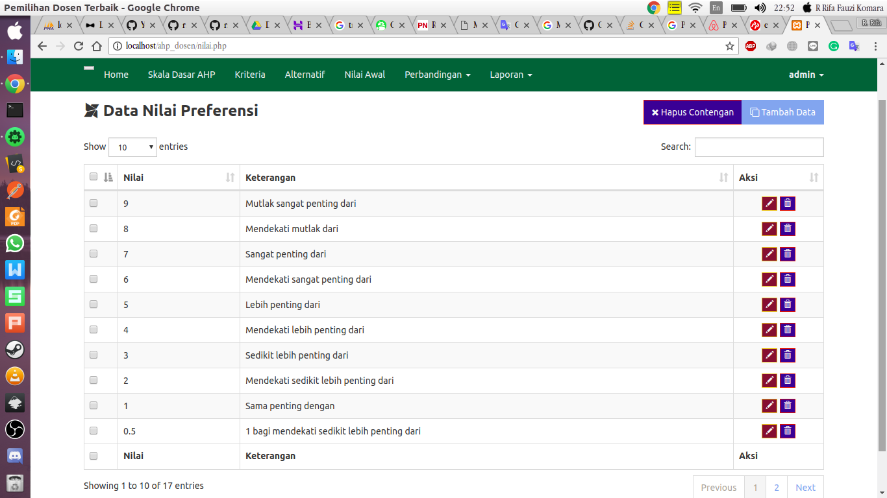         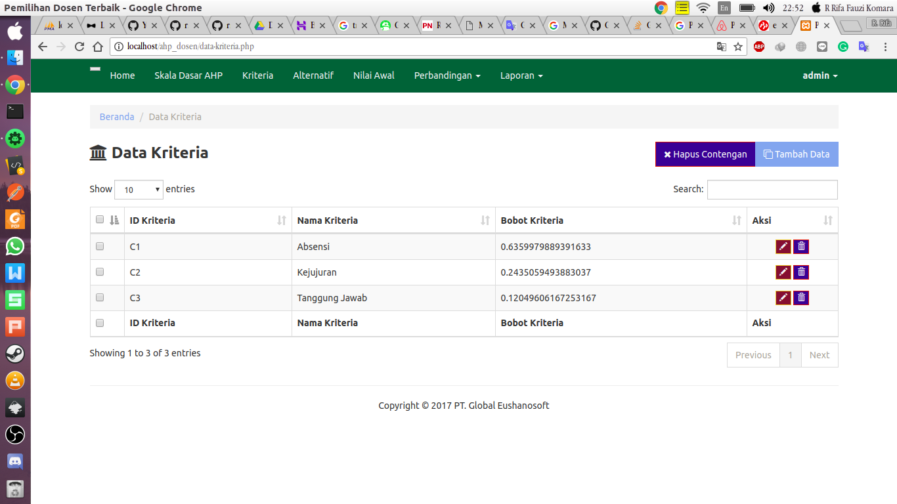         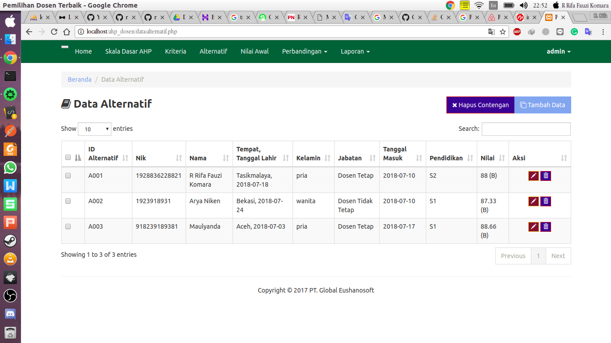         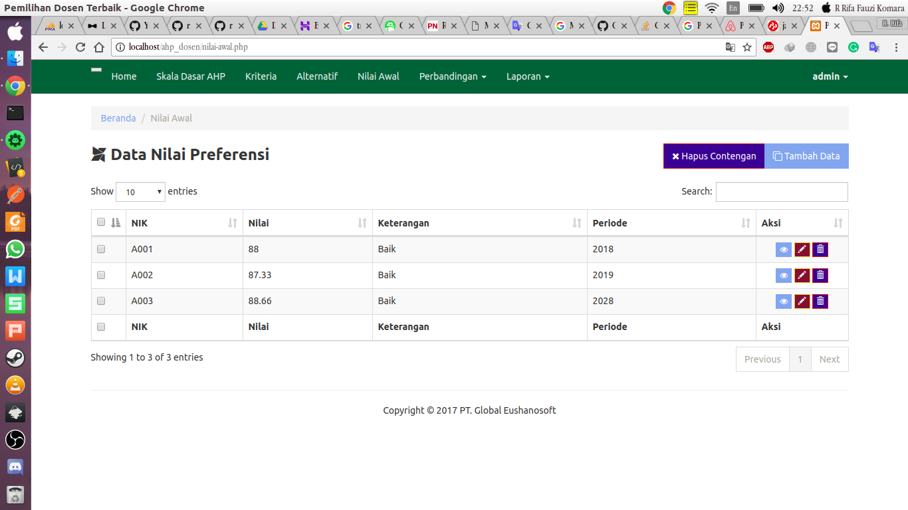
</pre>

<pre>
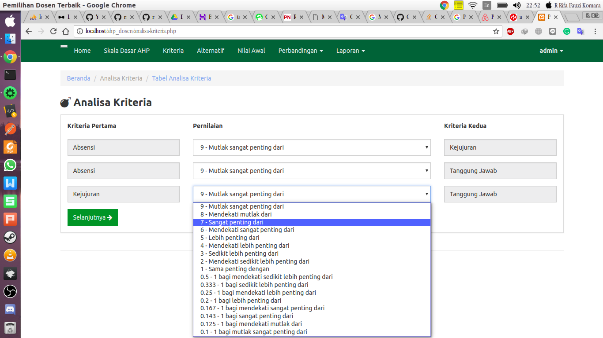         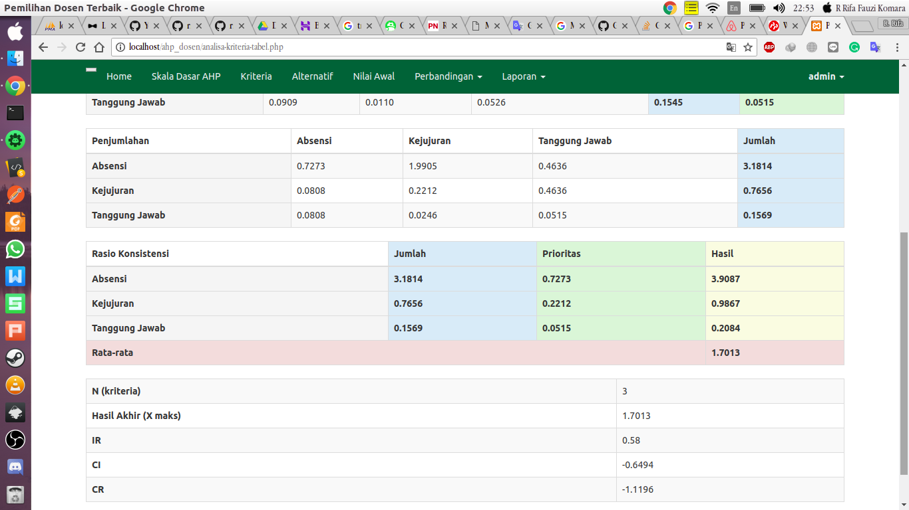         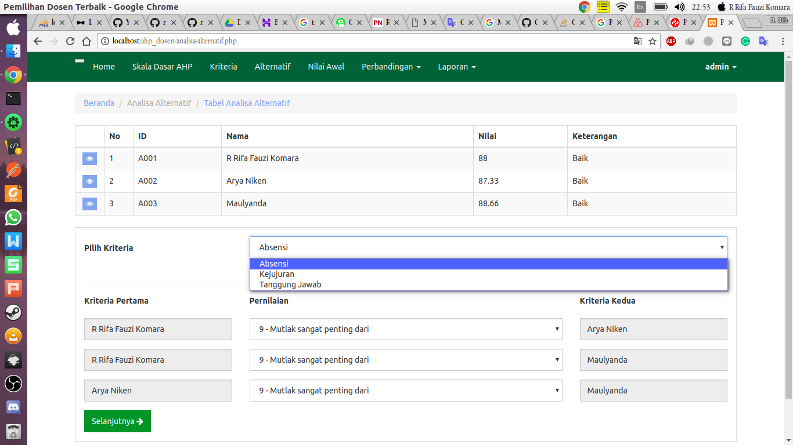         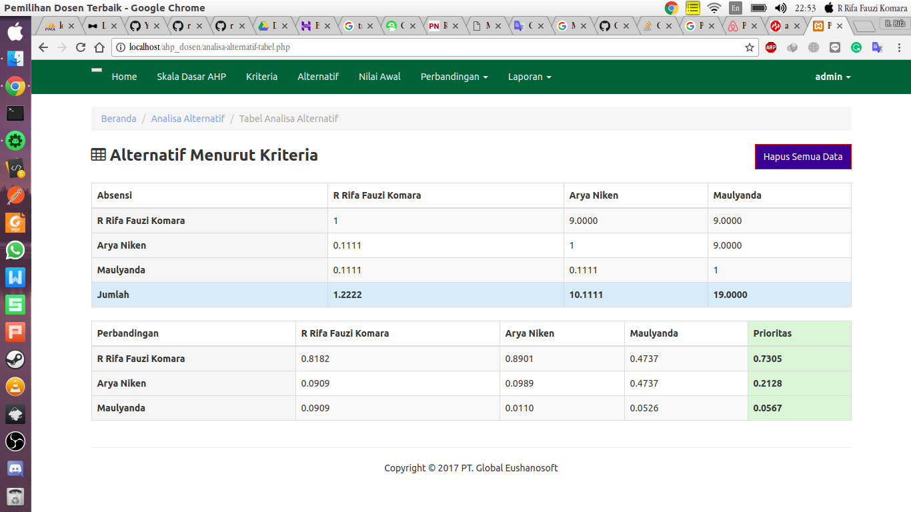         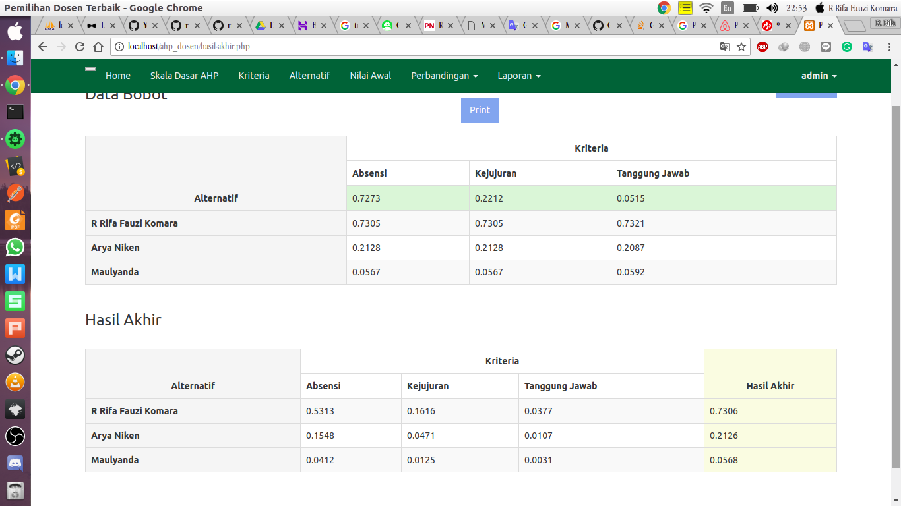         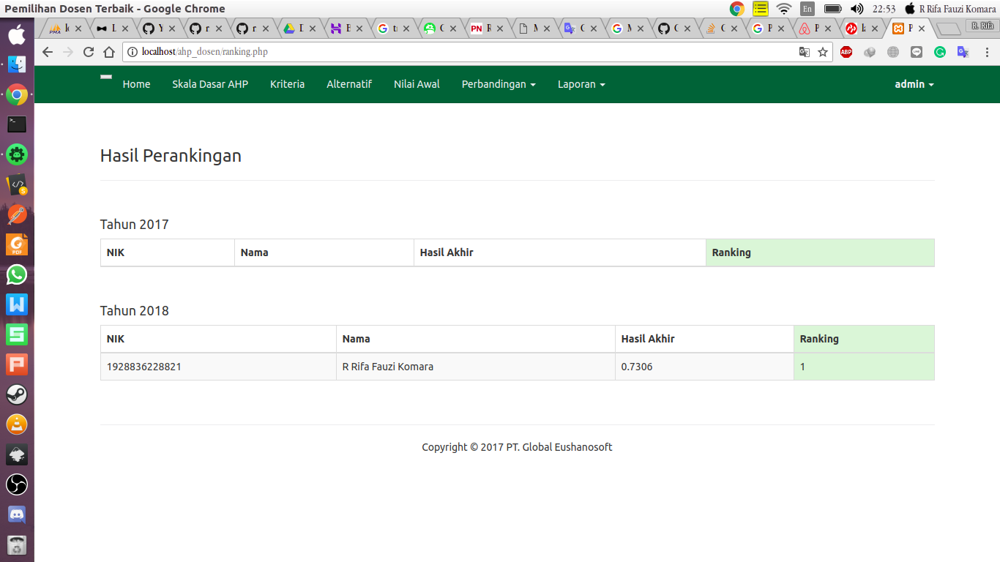
</pre>

### Fitur aplikasi

* [x] Login sebagai admin untuk menginputkan nilai-nilai yang dibutuhkan untuk mengola data dosen.
* [x] Halaman home terdapat beberapa fungsi, yaitu grafik usulan untuk mengetahui hasil akhir dari perbandingan, nilai preferensi, kriteria & bobot, skor alternatif & hasil.
* [x] Halaman prefensi untuk menginput data nilai preferensi dilengkapi dengan CRUD.
* [x] Halaman kriteria untuk menginput data nilai kriteria dilengkapi dengan CRUD.
* [x] Halaman alternatif untuk menginput data nilai alternatif dilengkapi dengan CRUD.
* [x] Halaman nilai awal untuk menginput data nilai awal dilengkapi dengan CRUD.
* [x] Halaman perbandingan nilai kriteria dan alternatif untuk mencari nilai bobot kriteria dan alternatif dilengkapi dengan CRUD.
* [X] Halaman laporan untuk mengetahui hasil akhir dari data nilai yang telah di bandingkan dilengkapi dengan fitur print dan perangkingan.

### Petunjuk menjalankan source code aplikasi

1. Login terlebih dahulu.
2. Ganti nilai Preferensi atau tetap seperti itu.
3. Isi nilai kriteria sesuai yang anda butuhkan.
4. Isi nilai alternatif sesuai yang anda butuhkan.
5. Jumlah data kriteria harus sama dengan jumlah nilai alternatif.
6. Isi nilai awal untuk menentukan siapa dosen terbaikya.
7. Tentukan perbandingan setiap nilai kriteria.
8. Tentukan perbandingan setiap nilai alternatif berdasarkan kriteria.
9. Cetak hasil akhir dari perbandingan dosen terbaik tersebut, dan untuk grafik rangkingnya bisa di lihat dihalaman home.

## Author

* **R Rifa Fauzi Komara**

Jangan lupa untuk follow dan ★

Untuk Database bisa hub : 081-221-841-320
